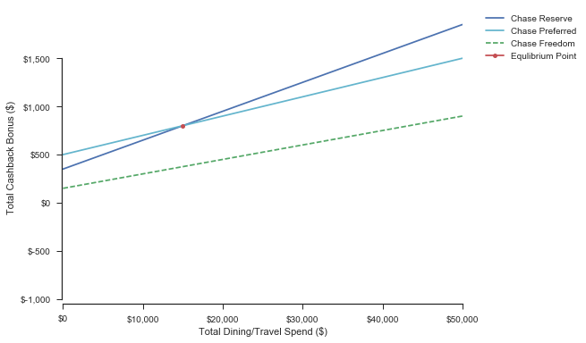
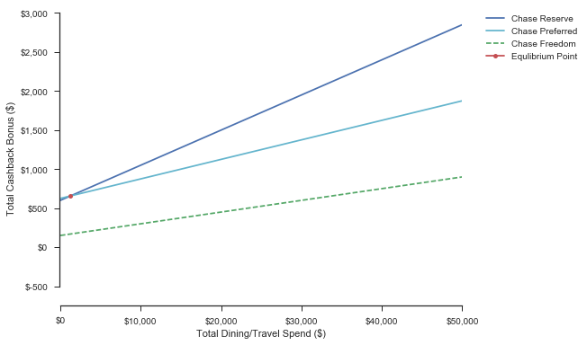
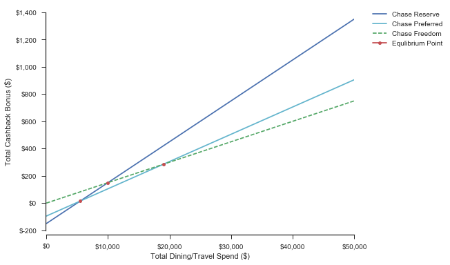
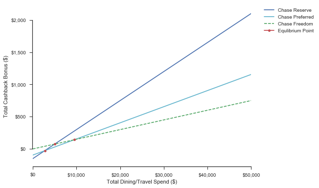

It's common knowledge that the Chase Sapphire Reserve and Preferred are two great cards, both for their cashback potential and initial sign on bonus. Given the free 50,000 point signup bonus alone, there's almost no reason not to get one. The hard part is deciding which one is actually better. The torrent of friends and colleagues inundating me with reasons that I should use their referral code certainly didn't make the decision any easier. In order to deal with this dillemna, I decided to approach it programatically.

### Chase Sapphire Reserve Benefits
The Chase Sapphire Reserve is the more higher end of the two cards, but it comes at a price - a hefty $450 yearly signup fee.
This cost is immediately offset though by a free $300 travel credit. Other benefits include...
* 50,000 points from spending $4000 in the first 3 months
* 3x Points from travel and dining
* 50% additional point value when applied toward travel expenses through Chase
* Some other random bonuses (TSA Precheck credit, Business lounges etc. all of which are relatively meh to me, and therefore excluded from this analysis)

### Chase Sapphire Preferred Benefits
The Chase Sapphire Preferred is another great travel card with similar bonuses. The yearly fee much lower - at $95 instead of $450, and it is waived the first year. In addition, you get...
* 50,000 points from spending $4000 in the first 3 months
* 3x Points from travel and dining
* 50% additional point value when applied toward travel expenses through Chase

### So How Do These Points Actually Translate into $ Amounts?
Like many other rewards cards, $1 spent equates to one point (1% cashback essentially). However, there is a point multiplier when the spend is categorized as travel, and dining ($1 * travel multiplier).
For redemption, basically, 1 point is worth $0.01 cash, or $0.01 * (Travel Multiplier) when redeemed toward travel. So knowing this, which card is actually the best to get?

### Modeling Each Card as a Linear Equation
Now that we know the reward conditions for each card, it is quite easy to model each as a linear equation, where `y` is equal to the cashback bonus, and `x` is equal to spend on the card.

In this equation the y-intercept is composed of the annual fee for the card, in addition to any intrinsic bonus points, converted to dollars (i.e signup bonus).

The β is composed of 3 components - The base `base spend to cashback multiplier * intrinsic point multiplier * redemption multiplier`
> i.e) `1% * 3.0 * 1.50 = .045` for the Chase Preferred card when redeeming points for travel

For simplicity, we are assuming that `x` is equal to travel and dining spend only. In addition, we are assuming that $300 will always be spent on travel if you have the Chase Reserve card, so the net yearly fee is $150.

In addition, I included the Chase Freedom card as a reference point. The bonus structure of this card is much simpler, consisting of a $150 sign up bonus, and a flat 1.5% cashback rate.

With these equations, we can now model several scenarios.

**Scenario 1: First Year = True, Points to Travel = False**  
The first scenario is that this is your first year with the card, but you are planning to redeem your points for cash instead of travel.


As you can see from the above equation, the βs are 0.3 and 0.2 respectively, representing the 3X and 2x point multipliers. They both have a signup bonus of 50,000 reward points, which equates for $500 when redeemed for cash. However, with the Chase Reserve, you still have to pay the $150 first year fee.  
As you can see, in this scenario, it is not worth to get the Chase Reserve unless you spend upward of $15,000 on dining and travel in a year (which is extremely unlikely for a simple man like me). Basically, the 2x-3x bump in signup bonus alone is basically complete negated by the fee difference.

```python
rv = rewards_viz(x, redemption_type='cash', first_year=True)
rv.comparison_pyplot()
```

Reserve > Preferred @ **Spend:** \$15,000 || **CashBack:** \$800
Reserve > Freedom @ **Spend:**\$-13,333 || **CashBack:**\$-50
Preferred > Freedom @ **Spend:**\$-69,999 || **CashBack:**\$-899



**Scenario 2: First Year = True, Points to Travel = True**  
The second scenario is that this is your first year with the card, but you are planning to redeem your points for travel.


In this instance, the equilibrium point is much more reasonable. This is because both the β and y-intercept of the Chase Reserve equation are higher, due to __a) The 1.5x point redemption multiplier to travel__ and __b) the increased $ value of the 50,000 free points__. In this case, the Chase Reserve is worth it if you spend at least $1250 on dining or travel in a year (easy), and redeem your points for $656 worth of travel (also relatively easy). 

```python
rv = rewards_viz(x, redemption_type='travel', first_year=True)
rv.comparison_pyplot()
```

Reserve > Preferred @ **Spend:** \$1,250 || **CashBack:** \$656
Reserve > Freedom @ **Spend:**\$-15,000 || **CashBack:**\$-75
Preferred > Freedom @ **Spend:**\$-47,499 || **CashBack:**\$-562



**Scenario 3: First Year = False, Points to Travel = False**  
Now that we have the first year scenarios out of the way, we can look at what makes each card worth it in the long run, without the hefty signup bonus.


When looking at the scenario where we do not redeem, our points for travel, we find that it may very well actually be a much better deal to get the Chase Freedom (Unless we are planning to spend >$10,000 on travel or dining during the year). In addition, the Chase Preferred now has a lot less value due to the $95 annual fee taking effect.

```python
rv = rewards_viz(x, redemption_type='cash', first_year=False)
rv.comparison_pyplot()
```

Reserve > Preferred @ **Spend:** \$5,500 || **CashBack:** \$15
Reserve > Freedom @ **Spend:**\$10,000 || **CashBack:**\$150
Preferred > Freedom @ **Spend:**\$18,999 || **CashBack:**\$284



**Scenario 4: First Year = False, Points to Travel = True**  
On the other hand, if we actually redeem our points for travel, the reward cards are a little more worth it.


In almost all cases, the Reserve will be better than the Preferred, once agian due to the annual fee. The Reserve surpasses the Freedom at $5000 of spend, and $225 ($75 + $150) redeemed toward travel, which is not unreasonable.

```python
rv = rewards_viz(x, redemption_type='travel', first_year=False)
rv.comparison_pyplot()
```

Reserve > Preferred @ **Spend:** \$2,750 || **CashBack:** \$-26
Reserve > Freedom @ **Spend:**\$5,000 || **CashBack:**\$75
Preferred > Freedom @ **Spend:**\$9,499 || **CashBack:**\$142



### Summary and Closing Thoughts
Ultimately, when deciding the value you will recieve from the card, you will need to evaluate two factors
1. Is it your first year with this card? AKA, will you recieve the sign up bonus
2. Will you actually redeem these points for travel?

The above scenarios, although informative, are greatly simplified and exclude a key element. In order to actually reach my decision on which card to get though, I had to consider the following.


Instead of immediately redeeming the 50,000 bonus points, it is possible to save them and then switch cards later for the bonus redemption value of a higher tier card. In this case, we would completely remove the signup equation from the bonus, and the only consideration would be the β associated with the increased dining and travel value (3x vs. 2x). Essentially, this is the exact same as the first scenario we considered. (First Year True, Travel False). In this case, the equilibrium point would once again be $15,000.  

Because of this, __I ultimatley decided to go with the Chase Preferred__. I live a relatively simple life so I highly doubt I will be spending $15,000 on dining and travel in the next year. Also, I am unsure of how much additional traveling I will do in the next year (Unfortunately, I booked a trip to Japan BEFORE getting either card). Now however, I will get a decent cashback bonus, and also have the flexibility to switch to the Chase Reserve if I indeed find out that I will be able to redeem the points for travel.  

In any case, you should ultimately make your decision based on how much you plan to spend and also redeem on travel.  
Thanks for reading! The notebook I used for this analysis can be found [here](https://github.com/andmatt/reward-card-comparison/blob/master/card-comparison.ipynb).
